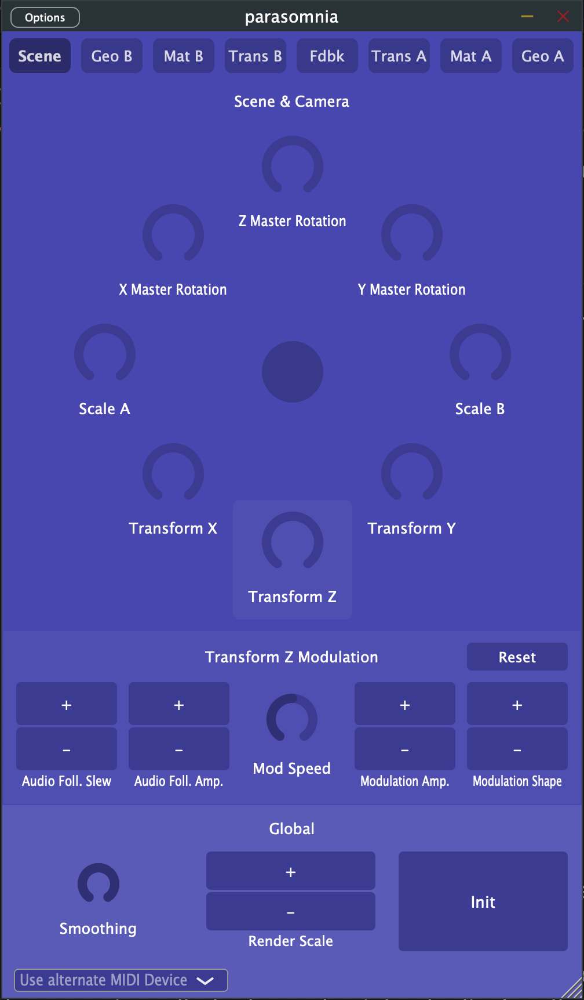

# Parasomnia

Parasomnia is a controller for the vidOS app by Sleepy Circuits. Using Parasomnia, you can control vidOS from a standalone application, or use your DAW to automate and map any of its many (many) parameters. The goal of the project is to enable access to as much of the vidOS featureset as possible, and follow along as it continues to evolve. Currently Parasomnia is compatible(ish) with the 1.4 version of vidOS.

# Requirements

- MacOS (tested on Sonoma 14.5)
- VST3 version should work with any VST3 host, tested with Ableton and Reaper.

# Installation

Note: You'll need to have a copy of [vidOS](https://apps.apple.com/ph/app/sleepy-vidos/id6448588001) installed on your MacOS or iOS device.

Head to the [releases page](https://github.com/jonatan-petursson/parasomnia/releases) for the latest release.

- VST3

  - Unpack the zip file and copy the .vst3 bundle to wherever your DAW looks for plugins (`/Library/Audio/Plug-Ins/VST3` by default).

- Standalone
  - Unpack the zip file and run the `Parasomnia.app` bundle.

# Getting Started

The interface closely mirrors the physical Mezzz unit so the excellent Sleepy Circuits [Mega Demo video](https://www.youtube.com/watch?v=EGYH6aY2e7Y) will get you aquainted with the controls.

If you're running vidOS on a separate device, you'll need to select the correct MIDI output device using the dropdown in the lower left of the plugin window.

To connect an iPad or iOS device to your Mac through Bluetooth MIDI I've had good success with the [midimittr app](https://apps.apple.com/us/app/midimittr/id925495245). In my experience, the best procedure is to advertise from the iPad, and then connect to the advertised device from the Mac using Audio Midi Setup, but your mileage may vary.

Note that the +/- button controls are not implemented as plugin parameters, so you can't automate them except by using the vidOS preset system. This is due to a protocol limitation.

The preset system is based on MIDI notes, which should work using normal MIDI routing through your DAW or MacOS. Hold a note for three seconds to save a preset, and press it to recall.

# Next Steps

- Start listening to and visualizing the MIDI data coming out of vidOS. For example modulation parameter changes are responded to with a `led_ring` message, which we could show.
- Add a preset pane that allows you to click to save and recall presets.

# License

Parasomnia is released under the [MIT License](https://opensource.org/licenses/MIT).
